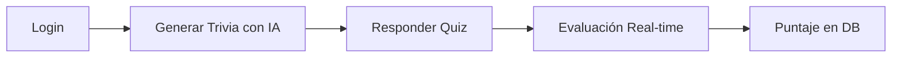

#  QuizAI: Sistema Inteligente de Trivia

> **Desarrollado con la API de Groq**

Bienvenido a **QuizAI**, una plataforma dinámica que fusiona la potencia de la Inteligencia Artificial con la gestión de datos moderna para crear cuestionarios personalizados en segundos.

---

##  El Concepto

A diferencia de los sistemas de trivia tradicionales, **QuizAI** no depende de una base de datos estática. El sistema "piensa" y genera contenido fresco sobre cualquier área de interés mediante modelos de lenguaje avanzados.

###  Flujo de Usuario



-----

## 🔥 Características Principales

  * ** Generación Autónoma:** Integración nativa con la **API de Groq** para crear bancos de preguntas únicos.
  * ** Seguridad:** Sistema de autenticación robusto para proteger los perfiles de usuario.
  * ** Gestión de Datos (CRUD):** Control total sobre el inventario de preguntas, respuestas y métricas de usuario.
  * ** Sistema de Scoring:** Algoritmo de evaluación que calcula y almacena el rendimiento en tiempo real.

-----

## Documentación de la API (Groq Integration)

API extraída de: [Google AI Studio](https://console.groq.com/keys)

El sistema consume el modelo de groq para generar los datos que poblarán directamente nuestro modelo relacional.


### Ejemplo de Prompting

> "Actúa como un generador de exámenes. Genera 5 preguntas sobre [Área de Interés] con nivel de dificultad [Nivel]. Devuelve un arreglo JSON donde cada objeto incluya el 'area_interes', el 'enunciado', el 'nivel_dificultad', y un arreglo de 4 'opciones'. Cada opción debe tener el 'texto_opcion' y un valor booleano 'es_correcta' (solo una debe ser true)."

### Estructura de Respuesta

```json
[
  {
    "area_interes": "Historia",
    "enunciado": "¿Quién fue el primer presidente de México?",
    "nivel_dificultad": "Fácil",
    "opciones": [
      { "texto_opcion": "Guadalupe Victoria", "es_correcta": true },
      { "texto_opcion": "Benito Juárez", "es_correcta": false },
      { "texto_opcion": "Porfirio Díaz", "es_correcta": false },
      { "texto_opcion": "Vicente Guerrero", "es_correcta": false }
    ]
  }
]
```

-----

##  Organización del Repositorio

| Carpeta | Contenido |
| :--- | :--- |
| `📂 src/` | Código fuente de la aplicación (Frontend/Backend). |
| `📂 propuesta/` | Contiene los **mockups**, **modelo de BD** y documentación técnica. |
| `📂 tests/` | Pruebas unitarias y de integración con **Playwright**. |

-----

##  Instalación y Uso

1.  **Clonar el repositorio:**
    ```bash
    git clone https://github.com/Hermes-Aguilar/propuesta
    ```
2.  **Configurar variables de entorno (.env):**
    ```env
    GROQ_API_KEY=tu_api_key_aqui
    DB_CONNECTION=tu_url_de_base_de_datos
    ```
3.  **Ejecutar pruebas:**
    ```bash
    npx playwright test
    ```

-----

##  Colaboradores

  * **Aguilar Villa Hermes** - *Fullstack Developer* - [@HermesAv](https://github.com/Hermes-Aguilar)
  * **Herrera Machorro Guadalupe** - *QA, Testing & DB Admin* - [@GuadalupeHm](https://github.com/Guadalupe0405)


-----

