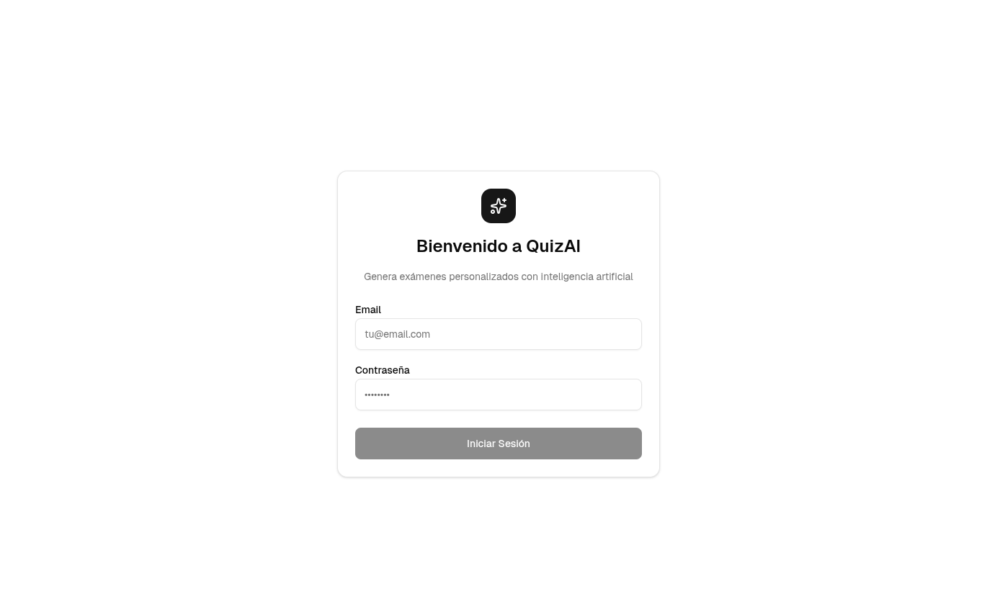
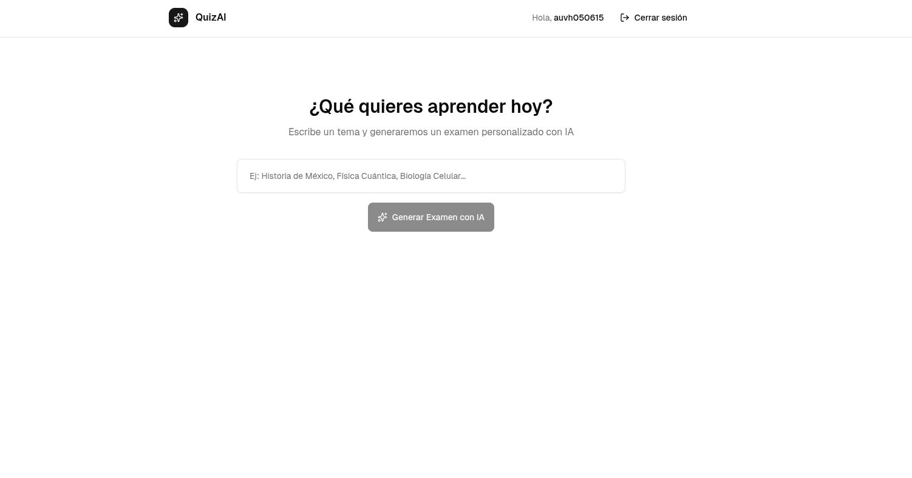
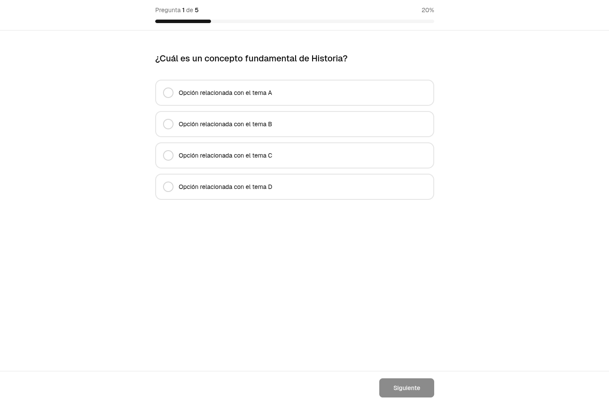
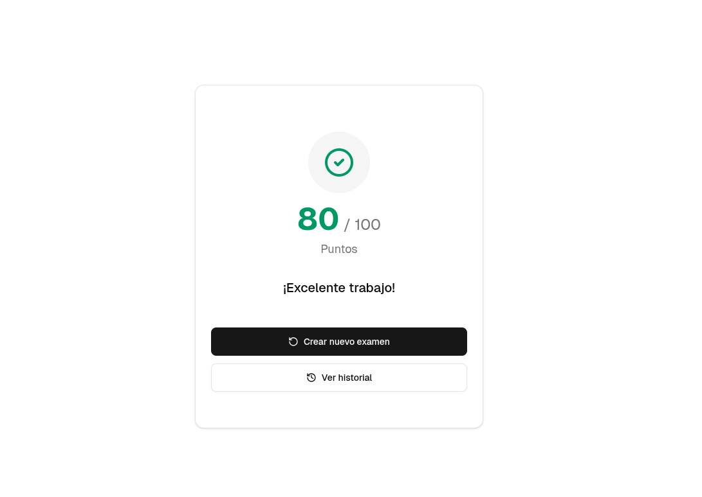
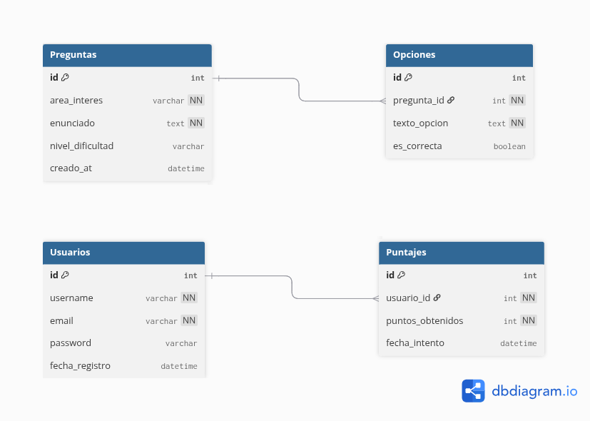

#  Documentación de la Propuesta Técnica

Este directorio contiene los artefactos de diseño y la arquitectura de datos para el proyecto **QuizAI**, cumpliendo con los entregables de la propuesta inicial.

---

##  1. Pantallas (Mockups / Sketch)

El diseño de la interfaz se centra en una experiencia de usuario limpia y directa. Consiste principalmente en las siguientes vistas:

###  Pantalla de Login
Autenticación de usuarios para acceder al sistema y registrar sus puntajes de forma segura.

  

 

###  Dashboard / Generador
Interfaz donde el usuario ingresa el área de interés para que la IA genere el banco de preguntas.

  

 

###  Vista de Cuestionario (Quiz)
Pantalla interactiva donde se muestran las preguntas generadas y el usuario selecciona sus respuestas.

  

 

###  Resultados
Muestra el puntaje final obtenido tras evaluar las respuestas.

  

 

---

##  2. Modelo de Base de Datos

Se optó por implementar una **Base de Datos Relacional (SQL)** para garantizar la integridad referencial entre los usuarios, sus puntajes y las preguntas generadas.

  

 

El diagrama adjunto en esta carpeta ilustra la siguiente estructura de 4 tablas principales:

###  `Usuarios`
Gestiona la autenticación y los perfiles.
* Almacena credenciales únicas (`username`, `email`) y contraseñas.
* Es la tabla base para relacionar y guardar el historial de calificaciones.

###  `Preguntas`
Almacena el banco de conocimiento generado dinámicamente por la API de Google Gemini.
* Guarda el enunciado exacto devuelto por la IA.
* Categoriza la pregunta mediante el área de interés y su nivel de dificultad.

###  `Opciones`
Tabla dependiente de `Preguntas` (Relación 1 a Muchos).
* Por cada pregunta generada, se almacenan 4 registros aquí (las opciones de respuesta múltiple).
* Utiliza una bandera booleana (`es_correcta`) para que el sistema interno sepa cuál evaluar como válida sin necesidad de volver a consultar a la IA.

###  `Puntajes`
Registra el rendimiento de los usuarios (Relación 1 a Muchos con `Usuarios`).
* Cada vez que un usuario finaliza un cuestionario, se inserta un registro con los puntos obtenidos y la fecha.
* Permite cumplir con el requerimiento de llevar el control de puntajes por usuario.

---
